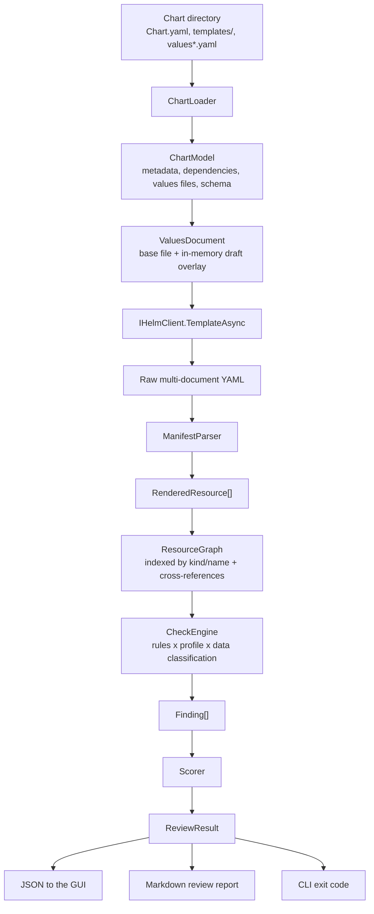

# ChartPilot — Architecture

This document describes how ChartPilot is put together: process shape, solution layout, the core pipeline, the check engine, the HTTP API, and the security posture of the tool itself.

The functional scope it implements is described in [`chartpilot-spec.md`](chartpilot-spec.md); the delivery order is in [`features.md`](features.md).

---

## 1. Guiding principles

1. **Local-first, offline, cluster-free.** ChartPilot renders and analyzes charts. It never needs a kubeconfig and never talks to a cluster. That makes it safe to point at production charts from a laptop.
2. **Read-only against the user's repo.** Editing happens in an in-memory workspace. Nothing is written back to the chart directory unless the user explicitly exports.
3. **The interesting logic is pure.** Everything after `helm template` is string in, findings out. That keeps the check engine unit-testable without Helm, Kubernetes, or a browser.
4. **One engine, three faces.** The GUI, the CLI and (later) a CI action all call the same `ChartPilot.Core` pipeline. A finding in the GUI and a finding in CI are the same finding, with the same id.
5. **Stable rule ids.** Every check has an id like `CP-SEC-001`. Ids are what make suppressions, CI gating, and report diffing possible.

---

## 2. Process shape

A single ASP.NET Core process serves both the JSON API and the built React SPA. There is no database and no external service.

```
Production / demo:
  dotnet run --project src/ChartPilot.Api
    ├─ /api/v1/*   Minimal API
    └─ /*          static files (the Vite build output)
  → http://127.0.0.1:5080

Development:
  vite dev  (port 5173) ──proxy /api──▶ dotnet watch (port 5080)

The API listens on 5080 in BOTH modes. 5173 is the Vite dev server's port and is never taken by
the API — Vite sets strictPort, so an API bound there would stop the dev server from starting.
```

Binding is **127.0.0.1 only**. ChartPilot renders arbitrary Go templates from charts the user points it at; it is not a service to expose on a network interface.

---

## 3. Solution layout

```
ChartPilot.sln
├── src/
│   ├── ChartPilot.Core/          # domain + pipeline. No process, no HTTP, no disk beyond abstractions.
│   │   ├── Charts/               # ChartModel, Chart.yaml + values file discovery, values.schema.json
│   │   ├── Values/               # merge, validate against schema, diff
│   │   ├── Manifests/            # multi-doc YAML → RenderedResource, ResourceGraph, cross-references
│   │   ├── Checks/               # IResourceCheck + the rule catalog (one file per rule family)
│   │   ├── Profiles/             # golden path profiles, data classification, severity resolution
│   │   ├── Scoring/              # category scores + overall
│   │   └── Reporting/            # Markdown report, GitHub Actions workflow generation
│   ├── ChartPilot.Helm/          # IHelmClient: locate the binary, run `template` / `lint` safely
│   ├── ChartPilot.Api/           # Minimal API host, workspace sessions, SPA hosting
│   ├── ChartPilot.Cli/           # `chartpilot check` — same Core, different face
│   └── chartpilot-web/           # React + TypeScript + Vite
├── tests/
│   ├── ChartPilot.Core.Tests/    # rule fixtures, parser, scoring, report snapshots
│   ├── ChartPilot.Helm.Tests/    # locator + argument construction (fake process runner)
│   └── ChartPilot.Api.Tests/     # endpoint contract tests via WebApplicationFactory
├── samples/charts/               # demo charts, incl. a deliberately bad one for the demo
└── docs/
```

`ChartPilot.Core` depends on nothing but YamlDotNet and a JSON Schema library. That constraint is deliberate — it is what keeps the engine reusable across GUI, CLI and CI.

---

## 4. The core pipeline

Everything ChartPilot does is one pipeline, entered at different points.



The boundary that matters is between **E** and **G**: `IHelmClient` is the only part that touches a process. Everything to the right of it is deterministic and covered by fixture-based tests, so the entire check catalog can be developed and tested without Helm installed.

### 4.1 ChartModel

Produced by reading the chart directory, not by shelling out:

- `Chart.yaml` → name, version, appVersion, description, type, maintainers, dependencies
- `values.yaml` plus any `values-*.yaml` siblings → the environment candidates
- `values.schema.json` → presence flag + the parsed schema (drives the guided editor)
- `templates/*` → file list and a cheap static scan for the Kubernetes kinds the chart *can* emit

The static kind scan is intentionally approximate — it powers the overview card before the first render. The Resource Explorer always shows what was actually rendered.

### 4.2 ResourceGraph

The parser turns the rendered YAML stream into `RenderedResource` records:

```csharp
record RenderedResource(
    string ApiVersion,
    string Kind,
    string Name,
    string? Namespace,
    string SourceTemplate,   // from the "# Source: chart/templates/x.yaml" comment Helm emits
    YamlNode Root,           // for rule traversal
    string Yaml);            // for display
```

`ResourceGraph` indexes them by `kind/name` and resolves the cross-references that make the interesting checks possible:

- `VirtualService` → the `Service` its routes point at, and the `Gateway` it binds to
- `Certificate` → its issuer and the TLS `Secret` it writes
- `Deployment` → its `ServiceAccount`, and the `Service`/`NetworkPolicy` that select its pod labels
- `AuthorizationPolicy` / `PeerAuthentication` → the workloads their selectors cover

Rules query the graph rather than re-scanning YAML. "Public VirtualService without an AuthorizationPolicy" is a graph question, not a text question — and that is precisely the class of finding a linter on a single file cannot produce.

---

## 5. The check engine

### 5.1 Rule contract

```csharp
public interface IResourceCheck
{
    CheckDescriptor Descriptor { get; }
    IEnumerable<Finding> Evaluate(CheckContext context);
}

public record CheckDescriptor(
    string Id,                    // "CP-SEC-001" — stable forever
    string Title,
    CheckCategory Category,       // Security | Reliability | Operability | Governance
    Severity DefaultSeverity,     // Info | Warning | Critical
    string Rationale,
    string Remediation,           // concrete: the YAML to add
    string? DocsUrl);

public record CheckContext(
    ResourceGraph Graph,
    ValuesDocument Values,
    Profile Profile,
    DataClassification Classification,
    string Environment);

public record Finding(
    string CheckId,
    Severity Severity,            // resolved, not the default
    ResourceRef? Resource,        // which resource, or null for chart-level
    string Message,
    string Remediation,
    string? YamlPath);            // e.g. spec.template.spec.containers[0]
```

Rules are registered by DI scan, so adding a check is adding one file plus one fixture test.

### 5.2 Rule id families

| Prefix | Category | Examples |
|---|---|---|
| `CP-REL-*` | Reliability | missing probes, no resource requests/limits, single replica in prod, no PodDisruptionBudget, no update strategy |
| `CP-SEC-*` | Security | runs as root, `privileged`, missing `runAsNonRoot` / `readOnlyRootFilesystem`, `latest` tag, inline secrets, SA token automount, missing NetworkPolicy, broad RBAC, public exposure the profile or `platform.exposure` forbids |
| `CP-NET-*` | Security/Operability | Istio: VirtualService without Gateway, public route without AuthorizationPolicy, no strict mTLS, missing DestinationRule, no timeout/retry |
| `CP-CERT-*` | Operability | cert-manager: missing `renewBefore`, excessive duration, unknown issuer, dangling TLS secret reference |
| `CP-OBS-*` | Operability | missing ServiceMonitor/Prometheus annotations, missing standard labels, no logging config, no request correlation |
| `CP-GOV-*` | Governance | missing `values.schema.json`, unpinned dependencies, missing ownership labels, undeclared data classification |

### 5.3 Severity resolution — why there is one rule, not six

A rule declares a *default* severity. The actual severity of a finding is resolved from context:

```
DefaultSeverity
  → promoted if the active Profile marks the requirement as mandatory
     (e.g. requireNetworkPolicy: true turns CP-SEC-008 Warning → Critical)
  → promoted again by DataClassification
     (sensitive-personal-data forces mTLS, NetworkPolicy and AuthorizationPolicy to Critical)
  → demoted / dropped by an explicit suppression
```

This is the design decision that makes golden path profiles cheap: a profile is data, not code. `sandbox-service` and `sensitive-member-data-service` run the *same* catalog and differ only in what they promote.

### 5.4 Suppressions

An optional `.chartpilot.yaml` next to the chart:

```yaml
suppress:
  - id: CP-SEC-004
    resource: Deployment/legacy-importer
    reason: "Vendor image requires a writable root filesystem; tracked in PLAT-412"
    expires: 2026-12-01
```

A `reason` is required, and an expired suppression becomes a `CP-GOV-*` finding of its own. Suppression-with-an-expiry-date is the difference between a policy tool teams adopt and one they route around.

### 5.5 Scoring

```
categoryScore = clamp(0, 100, 100 − Σ deductions)
   Critical = 25   Warning = 8   Info = 0

overall = 0.35·Security + 0.30·Reliability + 0.20·Operability + 0.15·Governance
```

Weights and deductions live in the profile, not in code, so an organization can tune the gate without a rebuild. The score is presented as a conversation starter, never as a pass/fail on its own — gating uses **`--fail-on critical`**, i.e. findings, with the score as context.

---

## 6. Helm integration

### 6.0 Target version

Developed against **Helm v4.2.4** (`winget install Helm.Helm`). The output contract ChartPilot depends on is unchanged from Helm 3, and has been verified on this machine:

- `helm template` writes a `---`-separated multi-document stream to stdout
- every document is preceded by a `# Source: <chart>/templates/<file>.yaml` comment — this is what populates `RenderedResource.SourceTemplate`, and therefore what lets a finding point back at the template that produced it
- `-f/--values`, `--set*`, `--dependency-update`, `--include-crds`, `--skip-tests` and `--kube-version` are all present
- `helm lint` emits `[INFO]/[WARNING]/[ERROR] <file>: <message>` lines, which map cleanly onto `CP-GOV-*` findings

`IHelmClient` parses only these two contracts, so a Helm 3 binary works too. The resolved version is reported by `/environment` and recorded in the review report, since a rendered manifest is only reproducible alongside the renderer that produced it.

Two rendering flags are deliberate defaults rather than pass-throughs: `--include-crds` is **on** (a chart that ships CRDs should have them reviewed) and `--skip-tests` is **on** (Helm test pods are not part of the deployed surface and would otherwise pollute the resource tree and the score).

### 6.1 Locating the binary

`helm` is typically not on the machine PATH in a predictable place — on this machine winget installed it to
`%LOCALAPPDATA%\Microsoft\WinGet\Packages\Helm.Helm_*\windows-amd64\helm.exe`. `HelmLocator` therefore resolves in order:

1. `ChartPilot:HelmPath` from configuration
2. `helm` on `PATH`
3. Well-known install locations (winget package dirs, `%ProgramFiles%\helm`, Chocolatey shims, `~/.local/bin`)

`GET /api/v1/environment` reports the resolved path and version, and the GUI shows an actionable banner with the install command when it is missing — instead of a cryptic 500 on first render.

### 6.2 Running it safely

`helm template` executes arbitrary Go templates from the chart. `IHelmClient` therefore:

- writes the draft values to a file in a **per-workspace temp directory**; user input is never concatenated into arguments
- passes **no kubeconfig and no `--dry-run`**, so a chart cannot reach a cluster even if it tries
- runs with `--dependency-update` **off** by default (it hits the network); enabling it is an explicit user action
- enforces a wall-clock timeout and an output size cap, and surfaces Helm's stderr verbatim into the GUI's error panel
- resolves the chart path under a configured allowlist root and rejects traversal

The allowlist root comes from `ChartPilot:AllowlistRoot` (or the `CHARTPILOT_ALLOWLIST_ROOT` environment variable). When neither is set the API falls back to the root of the checkout it is running from, so the bundled sample charts work out of the box; the CLI uses the parent directory of the chart it was pointed at. `GET /api/v1/environment` reports the effective root, and opening a chart outside it is a `400` at open time rather than a failure several requests later.

`helm lint` runs through the same client, and its output is folded into the findings list under `CP-GOV-*`.

---

## 7. HTTP API

Minimal API under `/api/v1`. A **workspace** is an in-memory session (chart path + draft values + last render), held in `IMemoryCache` with a sliding TTL and a temp directory that is deleted on eviction.

| Method | Route | Purpose |
|---|---|---|
| `GET` | `/environment` | helm path/version, availability, allowlist root |
| `GET` | `/browse` | list subdirectories under the allowlist root, flagging which are charts |
| `POST` | `/workspaces` | open a chart directory → workspace id + `ChartModel` |
| `GET` | `/workspaces/{id}` | chart overview |
| `GET` | `/workspaces/{id}/values` | a values file, or the current draft |
| `PUT` | `/workspaces/{id}/values` | replace the draft (validated against `values.schema.json` if present) |
| `GET` | `/workspaces/{id}/values/export` | download the edited values as a `values.yaml` file |
| `POST` | `/workspaces/{id}/render` | run `helm template` → resources + raw manifests |
| `POST` | `/workspaces/{id}/review` | render + run checks → findings + scores |
| `GET` | `/workspaces/{id}/diff` | structured diff across N values files |
| `POST` | `/workspaces/{id}/report` | Markdown review report |
| `POST` | `/workspaces/{id}/workflow` | generated GitHub Actions YAML |
| `GET` | `/profiles` | available golden path profiles |
| `GET` | `/checks` | the rule catalog (id, title, category, rationale) |

`GET /browse` backs the GUI's folder picker. A browser cannot hand a server an absolute path —
neither a file input nor the File System Access API exposes one — so the tree is walked server
side instead. Every listing is confined to the allowlist root, checked *before* existence so a
traversal attempt cannot be distinguished from a missing directory by probing, and hidden, system
and reparse-point directories are skipped. Paths come back relative to the root with forward
slashes, so whatever the browser returns can be posted straight to `POST /workspaces` with no
client-side path assembly.

Render and review are POSTs because they execute a process. Errors use `ProblemDetails`, with Helm's stderr in an extension member so the editor can point at the offending template line.

---

## 8. Frontend

React 19 + TypeScript + Vite. TanStack Query owns all server state; a small Zustand store holds only UI state (selected resource, active environment, panel sizes).

```
┌──────────────────────────────────────────────────────────────────────┐
│ Chart: member-api 0.3.1   Profile ▾   Environment ▾   Score 78/100   │
├───────────────┬──────────────────────────────┬───────────────────────┤
│ Chart         │  values.yaml   (Monaco)      │  Findings             │
│  overview     │                              │   Critical (2)        │
│               │  replicaCount: 3             │   Warnings (4)        │
│ Resources     │  image:                      │   Passed (11)         │
│  Workloads    │    repository: ghcr.io/...   │                       │
│  Networking   │    tag: "1.4.2"              │  Score breakdown      │
│  Security     │                              │   Security     65     │
│  Certificates │  ── or the rendered YAML ──  │   Reliability  80     │
│               │                              │   Operability  85     │
│               │                              │   Governance   70     │
└───────────────┴──────────────────────────────┴───────────────────────┘
```

- **Monaco** with the YAML worker for both the values editor and read-only manifest display; schema-driven completion when the chart ships `values.schema.json`.
- **Debounced live render**: 400 ms after the last keystroke, cancelling the in-flight request. A render is cheap (one process) but not free, so it is debounced rather than per-keystroke.
- **Findings are navigable**: clicking a finding selects the offending resource and scrolls Monaco to its `YamlPath`. This is the feature that turns a report into a workflow.
- The values editor and the rendered-manifest view share the pane via a toggle, so the cause/effect relationship stays on one screen.

---

## 9. CLI

Same Core, no HTTP:

```bash
chartpilot check ./chart \
  -f values-prod.yaml \
  --profile sensitive-internal-service \
  --report review.md \
  --fail-on critical
```

Exit codes: `0` clean, `1` gate failed, `2` execution error (chart or helm problem). That distinction is what lets a pipeline separate "the chart is bad" from "the tool broke".

---

## 10. Testing strategy

| Layer | Approach |
|---|---|
| Rules | Fixture manifests in `tests/.../Fixtures/`, one pair (violating, compliant) per rule. No Helm required. |
| Parser / graph | Multi-doc YAML fixtures including CRDs, list-wrapped docs, and empty documents. |
| Scoring | Table-driven: finding sets → expected category and overall scores. |
| Reports & workflow generation | Snapshot tests — the output is user-facing text, so diffs should be reviewed. |
| Helm client | Fake process runner asserting argument construction and timeout/cancellation behaviour. |
| API | `WebApplicationFactory` contract tests with a stubbed `IHelmClient`. |
| End-to-end | The deliberately-bad chart in `samples/charts/` must produce a known score. This doubles as the demo. |

---

## 11. Deferred by design

Called out explicitly so they read as decisions rather than omissions:

- **No cluster connectivity.** No live diff against a running release, no `helm get values`. It would double the security surface for a feature the spec does not need.
- **No chart repositories / OCI registries** in the first version. Local chart directories only; repo support is an additive `ChartSource` implementation.
- **No multi-user state.** Workspaces are in-process and non-persistent — appropriate for a local tool, and it keeps the auth question from existing at all.
- **No writing to the chart directory** except an explicit export action.
