# ChartPilot — Web UI Tutorial

A walkthrough of the ChartPilot GUI, using the sample charts that ship with the repository. Every
screenshot below is from a real session against Helm v4.2.4.

There is a styled version of this same walkthrough in [`tutorial.html`](tutorial.html) — open it
directly in a browser from a checkout; it needs no build step and no server.

If you want the command-line equivalent instead, see the CLI section of the [README](../README.md).

---

## 0. Start it

```bash
# from the repository root
dotnet run --project src/ChartPilot.Api
```

Open <http://127.0.0.1:5080/>.

The API listens on **5080 in every environment** and binds loopback only — it refuses to start on a
non-loopback address. If `src/chartpilot-web/dist` has been built, the same process serves the GUI;
otherwise build it once with `npm install && npm run build` in `src/chartpilot-web`.

For frontend development, run `npm run dev` instead and use <http://127.0.0.1:5173/>, which proxies
`/api` to the API on 5080. The two ports never collide.

ChartPilot needs `helm` on the machine, but **never a kubeconfig** — it does not contact a cluster.

---

## 1. The empty state

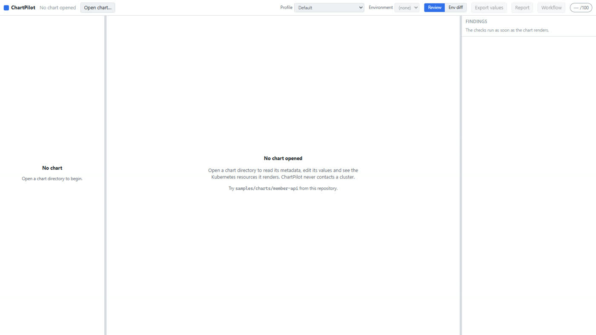

Three panes, and they stay in the same place for the whole session:

| Pane | What lives there |
|---|---|
| **Left** | Chart overview, then the tree of rendered Kubernetes resources |
| **Centre** | The values editor, toggled with the rendered manifest |
| **Right** | Findings, then the score breakdown |

The header carries everything that changes what you are looking at: the chart, the **Profile**, the
**Environment**, the Review/Env-diff switch, the three export buttons, and the score.

---

## 2. Open a chart

Click **Open chart…**, then **Browse…**.

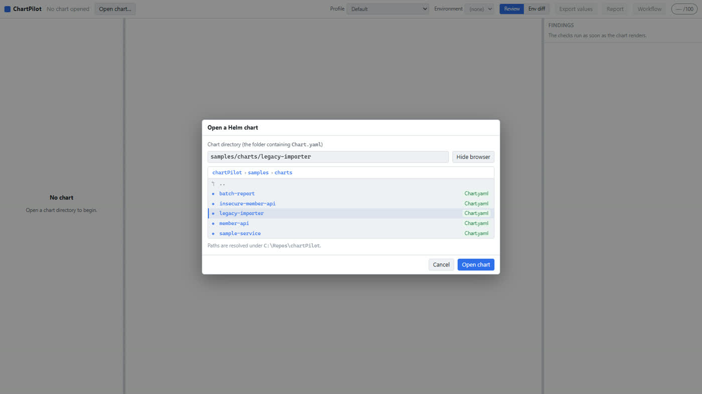

A browser cannot hand a server an absolute path, so ChartPilot walks the folder tree server side and
shows it here. Folders that contain a `Chart.yaml` are badged, so you can see which ones are charts
without opening them.

- **Single click** a chart folder to select it, **double click** to open it immediately.
- Any other folder navigates into it; the breadcrumbs walk back out.
- You can still type or paste a path — browsing just fills the same field.
- Everything is resolved under the **allowlist root** shown at the bottom of the dialog (by default
  the checkout the API runs from). Set `CHARTPILOT_ALLOWLIST_ROOT` to point it at your own repos.

For this walkthrough, open `samples/charts/legacy-importer` — a deliberately bad chart.

---

## 3. Read the chart

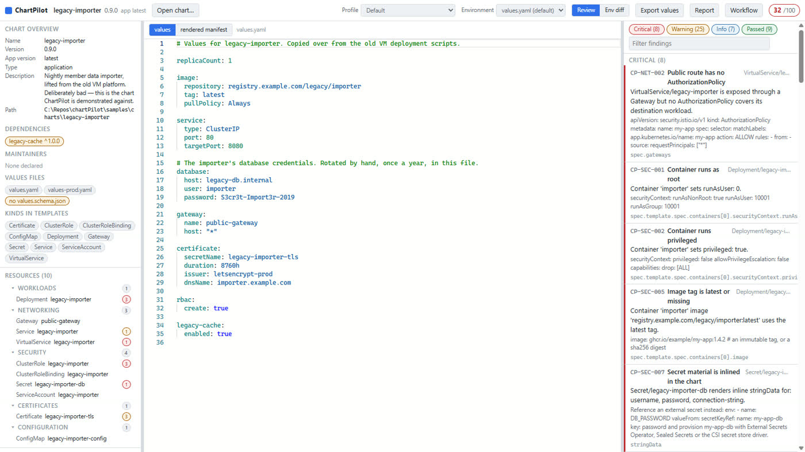

Opening a chart runs `helm template` immediately and evaluates every check, so the whole screen is
populated at once:

- **Chart overview** — name, version, appVersion, dependencies (with unpinned ones flagged),
  maintainers, the values files it found, whether it ships a `values.schema.json`, and the
  Kubernetes kinds its templates can emit.
- **Resources** — what was *actually* rendered, grouped as Workloads / Networking / Security /
  Certificates / Configuration. The number beside each resource is how many findings it carries.
- **Findings** — grouped Critical / Warning / Info / Passed, with a filter box.
- **Score** — overall plus one score per category.

`legacy-importer` scores **32/100** with 8 critical findings.

> **Passed findings are shown too.** An empty findings list means every check ran and passed — the
> panel says so explicitly, rather than leaving you guessing whether anything was evaluated.

---

## 4. Work a finding

Click any finding.

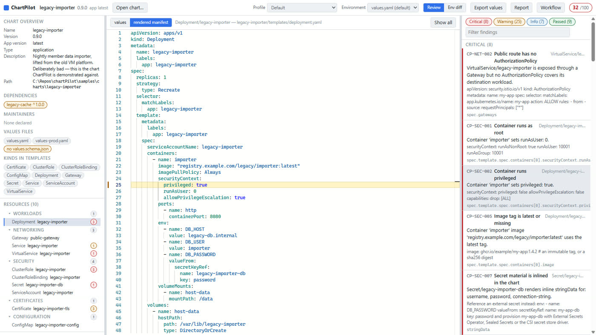

The centre pane switches to the **rendered manifest**, selects the offending resource, and
highlights the exact line — here `privileged: true` on line 25 of the rendered Deployment.

Each finding carries four things:

1. **The rule id** (`CP-SEC-002`) — stable, and the same id the CLI and CI report.
2. **What is wrong**, naming the resource and the container.
3. **A remediation snippet** you can paste — the actual YAML that fixes it.
4. **The YAML path** it applies to.

### When you do not understand a finding

Click **What should I do?** on any finding. It expands into:

- **What this means** — the finding restated without jargon, for a reader who has not met this rule
  before.
- **Why this severity** — when the profile or the data classification raised it, the exact sentence
  saying so: *"Raised from Warning to Critical because the 'Sensitive member data service' profile
  makes this a mandatory requirement."*
- **Your options** — two to four concrete ways out, each with the YAML and, importantly, its
  trade-off. One is marked *recommended* so there is always somewhere to start. The last option is
  often an honest waiver with an expiry date, because "accept this risk deliberately" is a real
  answer.

All of it ships with ChartPilot: no model, no network, no API key. The CLI prints the same guidance
with `--explain`, and the Markdown report carries the options for every critical finding, so a
reviewer reading a pull request sees the same choices you did.

The rule id families are `CP-SEC` (security), `CP-REL` (reliability), `CP-NET` (Istio and network),
`CP-CERT` (cert-manager), `CP-OBS` (observability) and `CP-GOV` (governance).

---

## 5. Change the profile — the same chart, judged differently

The **Profile** dropdown in the header picks a golden path. Switch `legacy-importer` from
**Default** to **Sensitive member data service**:

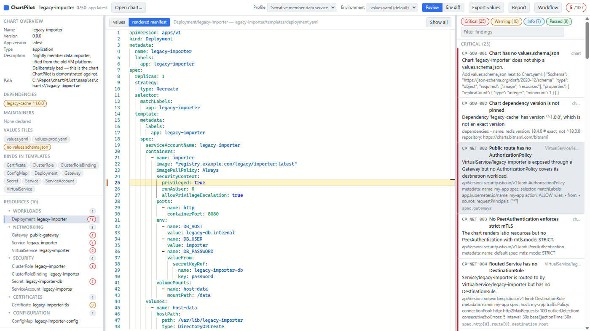

| | Default | Sensitive member data service |
|---|---|---|
| Overall | 32/100 | **5/100** |
| Critical | 8 | **25** |
| Warning | 25 | 10 |

Nothing about the chart changed. A profile does not run different rules — it **promotes severities**
on the same catalog. Missing a NetworkPolicy is a warning for a sandbox service and a critical
finding for one holding member data.

The footer of the score card always tells you what produced the number:
`env default · profile Sensitive member data service · classification Unclassified`.

Charts can also declare their own classification in values, which tightens the checks further:

```yaml
platform:
  dataClassification: sensitive-personal-data
  exposure: internal
```

---

## 6. Edit values and watch the manifest change

Switch the centre pane to **values**.

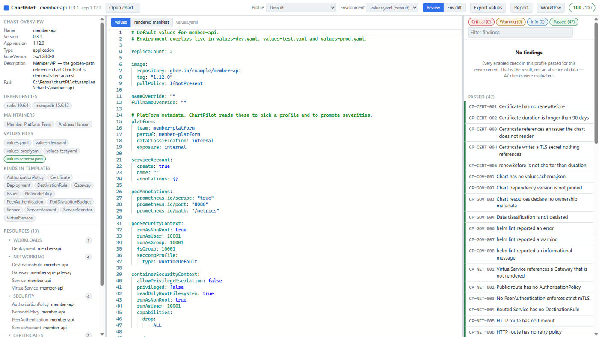

It is a full Monaco editor with YAML highlighting. When the chart ships a `values.schema.json`,
you also get completion, hover documentation and inline validation against that schema.

Your edits live in an in-memory **draft**. ChartPilot never writes to your chart directory — use
**Export values** when you want the edited file back.

Change something (`replicaCount: 2` → `5`) and switch to **rendered manifest**:

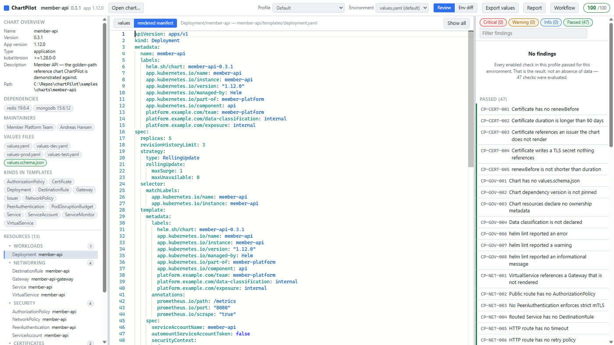

400 ms after you stop typing, ChartPilot re-runs `helm template`, re-parses the manifests and
re-runs every check. `replicaCount: 5` becomes `replicas: 5` in the Deployment, and the findings and
score update with it.

If your YAML is momentarily invalid, or a template fails, Helm's stderr appears in an error panel
under the editor — with the failing file and line linked, so you can click straight to it.

Use the **Environment** dropdown to switch which values file is the base (`values.yaml`,
`values-prod.yaml`, …). Everything re-renders and re-scores.

---

## 7. Compare environments

Click **Env diff** in the header.

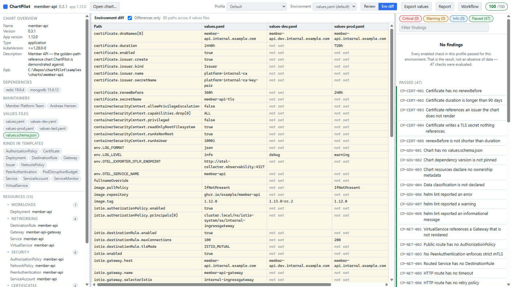

Every values file side by side, one row per leaf path, with **Differences only** on by default. For
`member-api` that is 80 paths across four files.

This is the view that answers "is prod actually stricter than dev?" — `env.LOG_LEVEL` goes
`debug → info → warning`, `image.tag` is `1.13.0-rc.2` in dev but `1.12.0` in prod, and
`istio.destinationRule.maxConnections` doubles. Anything only set in one environment shows as
*not set* in the others, which is usually where the surprises are.

---

## 8. Get the review out of the tool

Three buttons in the header, all of which open a dialog you can copy from.

**Export values** — the edited values as YAML, ready to paste back into your repo.

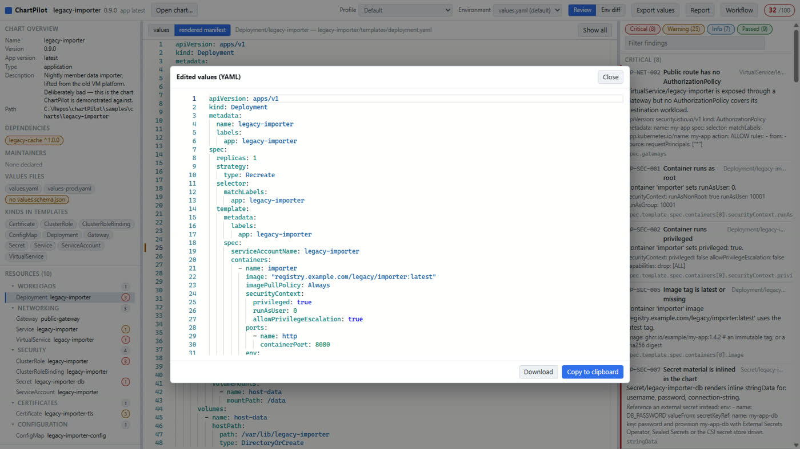

**Report** — the full review as Markdown: score table, rendered resources, critical findings,
warnings and recommended actions. Written to be pasted into a pull request as-is.

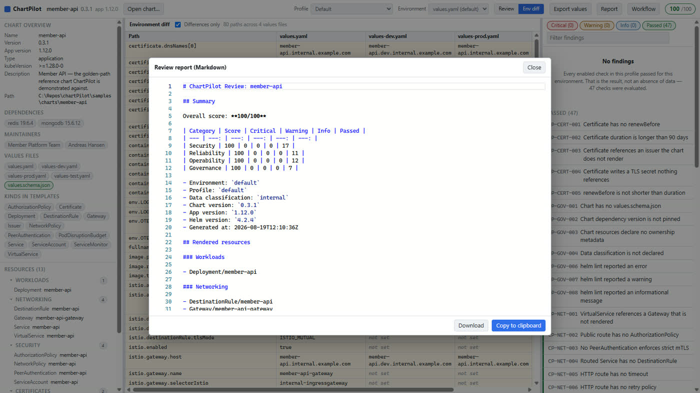

**Workflow** — a GitHub Actions workflow for this chart: lint, render, run `chartpilot check`
against the profile you selected, then deploy per environment.

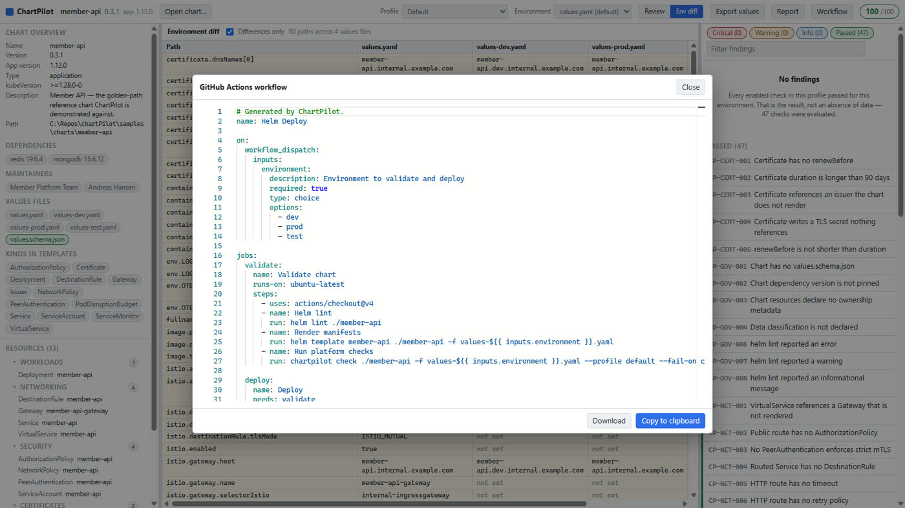

---

## 9. A suggested first session

1. Open `samples/charts/member-api` on the **Sensitive member data service** profile — the
   golden-path reference chart. It scores **100/100**, so you can see what "good" looks like.
2. Open `samples/charts/legacy-importer` on the same profile. It scores **5/100**. Read the criticals
   top to bottom; each one names a real production risk.
3. Fix one in the values editor and watch the score move.
4. Export the report and compare it against what your own charts would produce.

---

## Keyboard and mouse

| Action | How |
|---|---|
| Close a dialog | `Esc` |
| Open the selected chart | `Enter` in the path field |
| Select a chart folder / open it | single click / double click |
| Jump to a finding's line | click the finding |
| Show one resource instead of the whole manifest | click it in the resource tree |
| Resize the panes | drag the separators between them |

---

## Troubleshooting

**"Helm is not available"** — the banner tells you the install command
(`winget install Helm.Helm`). ChartPilot looks for the binary in configuration, then `PATH`, then the
usual install locations, and reports what it found at `GET /api/v1/environment`.

**"Chart is outside the allowlist root"** — charts must live under the allowlist root. Point it
somewhere wider:

```bash
CHARTPILOT_ALLOWLIST_ROOT=C:\Repos dotnet run --project src/ChartPilot.Api
```

**A render fails** — the error panel shows Helm's stderr verbatim, including the template and line.
That is Helm's own message; ChartPilot does not reinterpret it.

**Nothing renders, but there is no error** — the chart's values may have every optional resource
disabled. Check the values editor for `enabled: false` flags.
